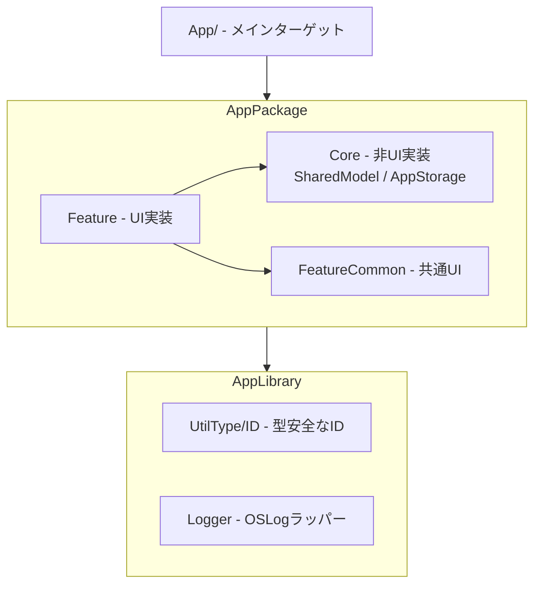
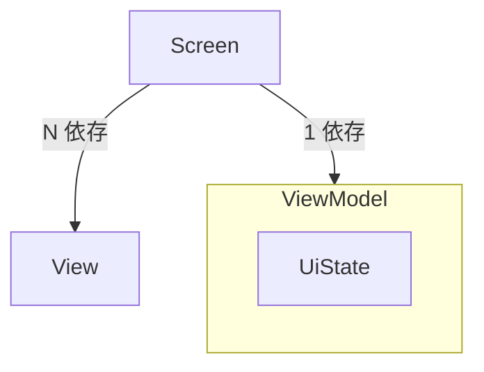
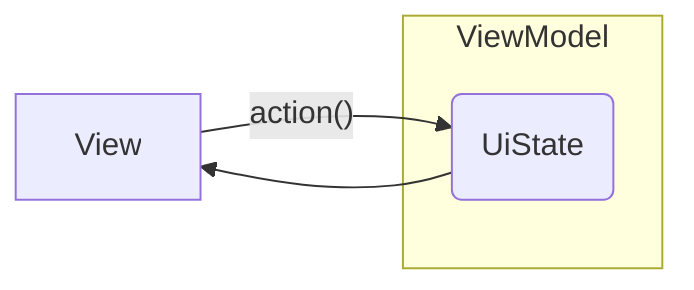

# アーキテクチャ概要

Appターゲットはアプリ起動用のエントリで、SwiftPackage の AppPackage/ を中心に開発を行う。



## モジュール戦略

PDS(Presentation Domain Separation) を実現するため、`Package.swift` によるマルチモジュール構成を採用し、
Presentation(UI) と Domain(UI以外) を水平分割する。

### Feature層

| モジュール | 役割 |
|---|---|
| `AppFeature` | 各Featureを束ねるルート |
| `TaskFeature` | タスク一覧表示 |
| `SettingFeature` | 設定画面 |
| `OnboardingFeature` | オンボーディング画面 |
| `FeatureCommon` | 複数Featureで共通利用するUIコンポーネント |

Featureモジュール間の依存は禁止。Feature間の連携は `AppFeature` が仲介する。

### Core層

| モジュール | 役割 |
|---|---|
| `AppStorage` | アプリ設定・タスクデータの永続化。[swift-dependencies](https://github.com/pointfreeco/swift-dependencies) の `@DependencyClient` で `OnboardingClient`・`ResetTimeClient`・`TaskStorageClient` を定義し、UserDefaults の実装詳細を隠蔽する |
| `SharedModel` | Feature間で共有するモデル定義 |

依存関係:

```
AppFeature → TaskFeature → AppStorage → SharedModel → UtilType (AppLibrary)
                         → FeatureCommon
AppFeature → SettingFeature → AppStorage → swift-dependencies
AppFeature → OnboardingFeature
AppFeature → AppStorage (OnboardingClient, ResetTimeClient, TaskStorageClient)
```

## スクリーンアーキテクチャ

- Screen:
  - 1ページ（画面全体）を示す。また、ナビゲーションを担当する
  - ビューの状態管理用の ViewModel を保持する
  - 任意のタイミングで、配下の View にイベントを伝搬する
- View
  - Screen から呼び出されるステートレスのビュー
  - 自身の状態を更新するようなイベントは親の Screen に委譲する
- ViewModel
  - ビューの状態保持と状態更新を行う要素
  - インプットとなる Actionメソッド と、アウトプットの UiState をまとめる

```swift
// Screen の例（SettingScreen）
// ViewModel を保持し、UiState とイベントコールバックを View に渡す
public struct SettingScreen: View {
  private let viewModel: SettingViewModel

  public init(viewModel: SettingViewModel) {
    self.viewModel = viewModel
  }

  public var body: some View {
    NavigationStack {
      SettingView(
        uiState: viewModel.uiState,
        onUpdateResetTime: { viewModel.updateResetTime($0) }
      )
      .navigationTitle(String(localized: "Setting", bundle: .module))
    }
  }
}
```

## ビューの状態管理

ビューの状態更新には、ViewModel を使った単方向データフロー（UDF）を利用する。
UDFとは、状態が下方に流れ、イベントが上方に流れる設計パターンのこと。



### UiState

- Uiそのものに関しての構造体
- 振る舞いは持たず、View にバインドされる存在

### ViewModel

- プレゼンテーションロジックの実装および状態管理
- UIState を保持し、単一の情報源（Single Source Of Truth）を実現する
- View から呼び出された Actionメソッド を起点に UIState を更新する



### Screen (SwiftUI.View)

- SwiftUIで実装された画面
- ViewModelに依存する
- ユーザーアクション、システム要求の Action を発火し、ViewModel が保持する UiState を更新する
